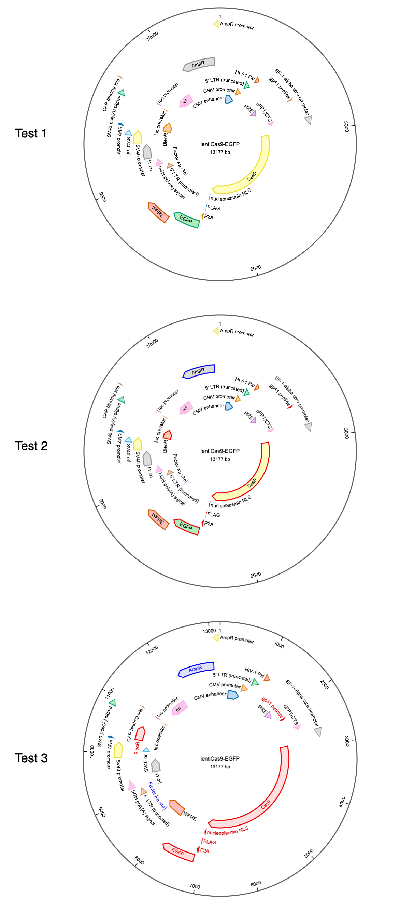

# Plasmidviewer
Plasmidviewer is a Python library to visualize plasmid maps from GenBank.
This library provides only the function to visualize circular plasmids and doesn't provide functions to edit nucleotides and sequence features.
If you want to do such operations, please use [QUEEN](https://github.com/yachielab/QUEEN), which I have recently developed.
(In fact, this library is implemented based on the visualization function of [QUEEN](https://github.com/yachielab/QUEEN)) 

## Installation
You can install this library using the following single command:
`pip install git+https://github.com/ponnhide/plasmidviewer.git`

## Example code

```python
    import plasmidviewer as pv
    from Bio import SeqIO
    record = SeqIO.read("../example_data/addgene-plasmid-63592-sequence-334654.gbk", format="genbank") 
    feats  = []
    facecolors  = []
    edgecolors  = []
    labelcolors = [] 
    for feat in record.features:
        if feat.type == "source" or feat.type == "primer_bind":
            pass 
        else:
            feats.append(feat)  
            if feat.type == "CDS" and feat.strand >= 0:
                facecolors.append("#FFDFDF")
                edgecolors.append("#EE0000") 
                labelcolors.append("#DD0000") 

            elif feat.type == "CDS" and feat.strand == -1:
                facecolors.append("#DFDFFF")
                edgecolors.append("#0000EE") 
                labelcolors.append("#0000DD") 
            else:
                edgecolors.append(None)
                labelcolors.append(None)
                facecolors.append(None)

    fig, ax = pv.visualize(record, feature_list=feats, title="lentiCas9-EGFP")
    fig.savefig("test1.pdf")
    
    fig, ax = pv.visualize(record, feature_list=feats, edgecolor=edgecolors, title="lentiCas9-EGFP")
    fig.savefig("test2.pdf") 
    
    fig, ax = pv.visualize(record, feature_list=feats, facecolor=facecolors, edgecolor=edgecolors, labelcolor=labelcolors, title="lentiCas9-EGFP", tick_interval=1000)
    fig.savefig("test3.pdf") 
```

## Example images

